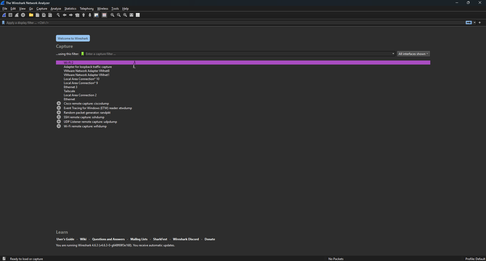
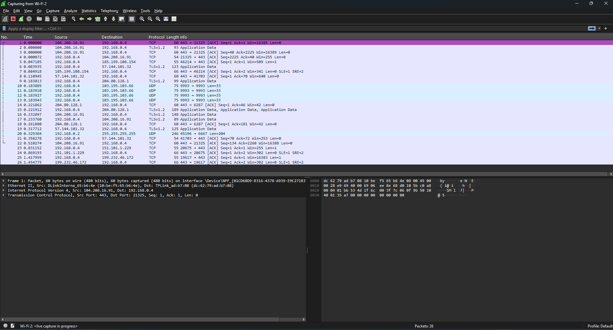
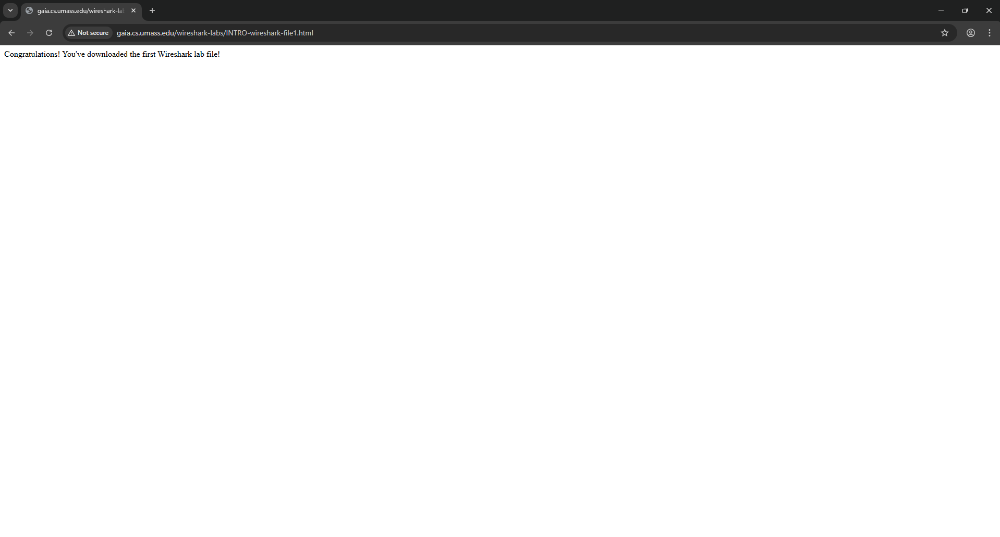
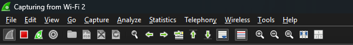
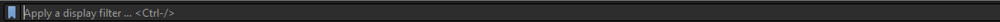
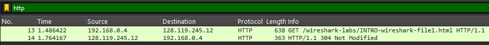
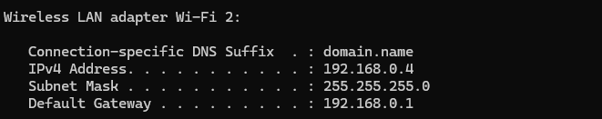

# Laporan Week 1 Jaringan Komputer
## Nama : Natan Winson Pratama NIM:103072400025
### Pengenalan Aplikasi Wireshark
1. Melakukan instalasi Wireshark dapat di <i>Download</i> pada [Link Disini](https://www.wireshark.org/download.html) (https://www.wireshark.org/download.html)

2. Tampilan awal wireshark
 

 
Dapat dilihat pada gambar ada banyak sekali interfaces yang dapat kita capture log nya atau kita <i>watch</i> (monitor)

3. Memilih Interface (Wi-Fi 2) 
Saya akan menggunakan interface wireless disini. (karena akses internet yang ada pada pc saya hanya pada interface Wi-Fi 2)

4. Layar Awal
 

 
Disini kita melihat semua hasil capture packet yang sedang berlangsung secara <i>realtime</i> memungkinkan kita untuk melihat apa saja yang sedang berlangsung pada jaringan Wi-Fi 2

5. Melakukan test dasar HTTP pada Browser  

Membuka web dengan protocol http (harus!) karena https memberikan respons yang berbeda karena telah di enkripsi demi keamanan
(http://gaia.cs.umass.edu/wireshark-labs/INTRO-wireshark-file1.html) 
[Link](http://gaia.cs.umass.edu/wireshark-labs/INTRO-wireshark-file1.html)

6. Setelah membuka web hentikan proses capture

Dengan cara menekan icon kotak merah

7. Lakukan filter khusus HTTP

isi dengan http (lowercase)

dapat dilihat pada baris pertama kita berhasil melaksanakan method GET pada
wireshark-labs/INTRO-wireshark-file1.html yang dimana server (Destination) berada pada 128.119.245.12 sedangkan source sendiri dapat kita lihat pada 
CMD dengan mengetikkan <i>command</i> `ipconfig`

dapat dilihat sama seperti gambar sebelumnya yakni 192.168.0.4 dengan prefix /24 dan protocol IPv4

