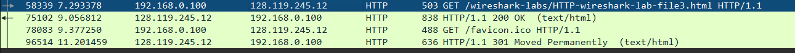
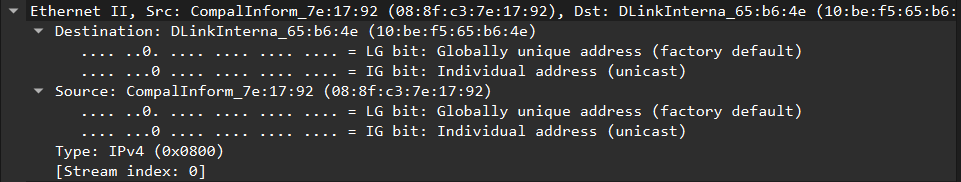
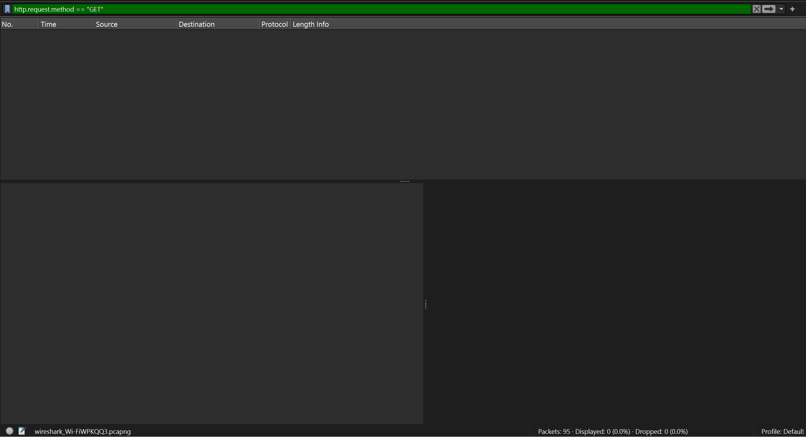
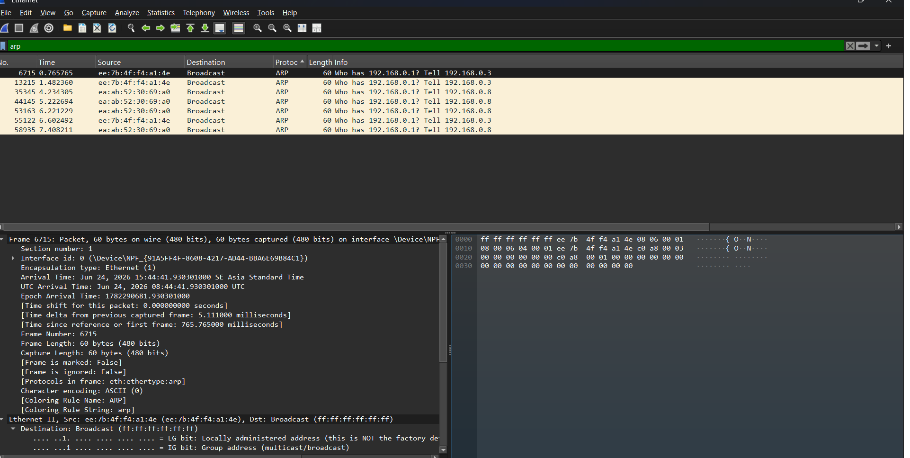

# Modul 13 – Ethernet dan ARP (Wireshark)

## 1. Tujuan Praktikum
Mahasiswa dapat menginvestigasi cara kerja protokol Ethernet dan ARP menggunakan Wireshark.

---

## Tools
- Wireshark
- Command Prompt / Terminal / Powershell

## 2. Analisis Ethernet Frame

Pada bagian ini dilakukan capture paket saat mengakses sebuah halaman web menggunakan Wireshark. Tujuannya adalah mengamati frame Ethernet yang membawa data HTTP (khususnya HTTP GET request).

### 2.1 Capture Traffic di Wireshark

Wireshark dijalankan terlebih dahulu sebelum membuka URL berikut:

http://gaia.cs.umass.edu/wireshark-labs/HTTP-wireshark-lab-file3.html

Hasil capture awal:



---

### 2.2 HTTP GET Request

Setelah halaman diakses, ditemukan paket HTTP GET yang dikirim dari komputer ke server.

HTTP GET packet:


---

### 2.3 Detail Ethernet Frame

Packet HTTP GET kemudian dianalisis pada layer Ethernet untuk melihat informasi MAC address source dan destination.

Ethernet frame detail:



---

### 2.4 Filter Non-IP Protocol

Untuk fokus pada Ethernet dan ARP, protokol IP dinonaktifkan melalui menu *Analyze → Enabled Protocols*.

Tampilan setelah IP dimatikan:



---

## 3. Analisis ARP (Address Resolution Protocol)

ARP digunakan untuk melakukan mapping antara IP address dan MAC address di jaringan lokal.

---

### 3.1 ARP Cache Clearing

Sebelum analisis ARP dilakukan, cache ARP dihapus agar proses request dapat terlihat di Wireshark.

Perintah:
```
arp -d *
```

ARP cache setelah dibersihkan:


---

### 3.2 ARP Request

ARP Request adalah paket broadcast yang digunakan untuk mencari MAC address dari sebuah IP tertentu.

Pada hasil capture terlihat paket:

> Who has 192.168.1.100? Tell 192.168.0.3

Ini menunjukkan bahwa perangkat sedang meminta informasi MAC address dari IP 192.168.1.100.

ARP Request (broadcast):



---

### 3.3 ARP Reply

ARP Reply adalah respon dari perangkat yang memiliki IP yang diminta, berisi MAC address yang sesuai.

Pada capture terlihat:

> 192.168.0.100 is at 52:ff:da:f8:26:4b

Ini berarti perangkat dengan IP tersebut memberikan alamat MAC-nya.

ARP Reply:


---

## 4. Kesimpulan

- Ethernet digunakan untuk komunikasi data pada layer data link menggunakan MAC address.
- ARP berfungsi untuk menerjemahkan IP address menjadi MAC address.
- ARP Request digunakan untuk menanyakan pemilik IP tertentu.
- ARP Reply digunakan untuk memberikan jawaban berupa MAC address.
- Wireshark memungkinkan analisis detail komunikasi jaringan hingga layer Ethernet dan ARP.
```