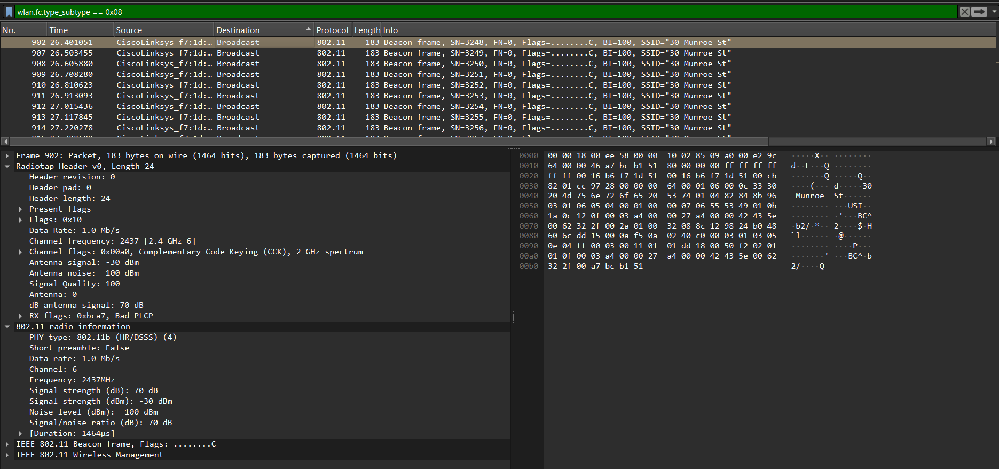
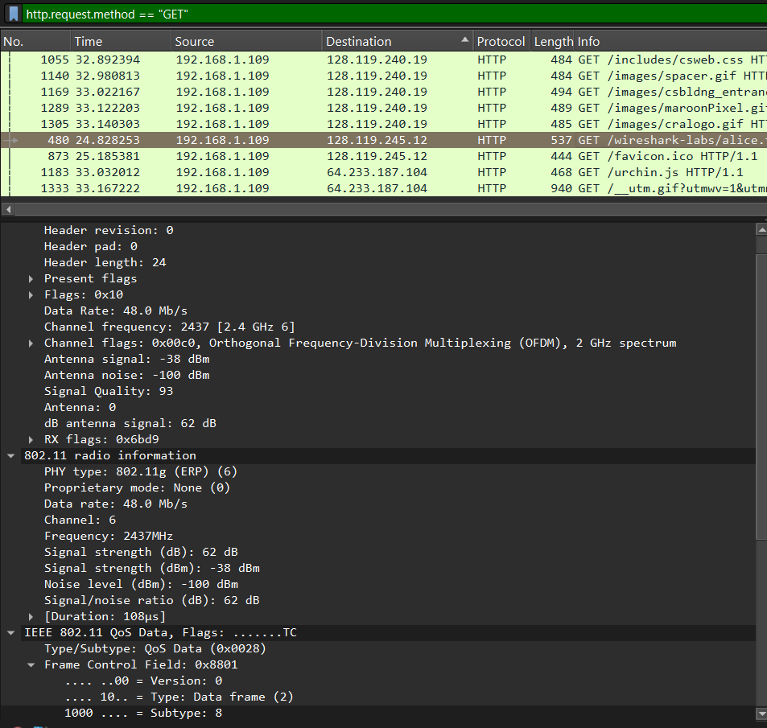

# Laporan Praktikum Jaringan Komputer (Week 2)

## Nama : NATAN WINSON PRATAMA
## Nim  : 103072400025

### 1. Apa itu 802.11
IEEE (Institute of Electrical and Electronics Engineers) 802.11 merujuk pada serangkaian standar yang mendefinisikan komunikasi untuk LAN nirkabel (jaringan area lokal nirkabel, atau WLAN), yang umumnya dikenal sebagai WiFi.

### 2. Cara mencari packet yang memiliki 802.11 di dalamnya
Untuk mencari packet dengan protokol 802.11, kita dapat menggunakan sebuah filter seperti  ``wlan.fc.type_subtype == 0x08`` yang nantinya akan mencari semua packet dengan beacon frame.

Kita dapat melihat informasi seperti tipe teknologi wifi, format header, kecepatan pengiriman data, frequency, dan kekuatan signal.

**atau**

kita dapat langsung menggunakan ``http.request.method == "GET"`` jika ingin mencari packet dengan protokol **GET**.

