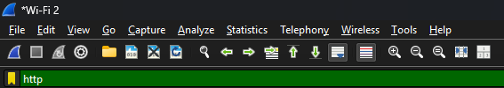
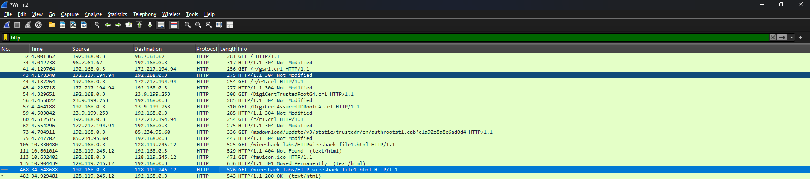
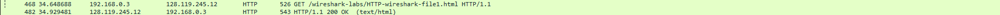
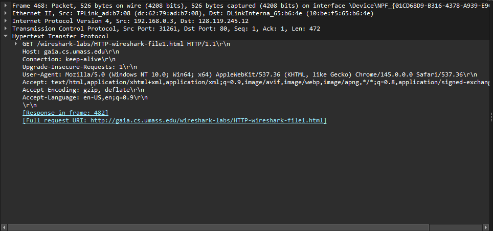
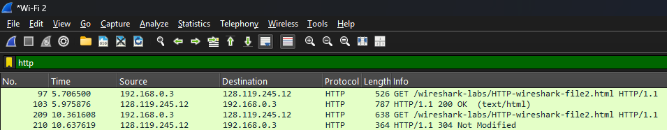
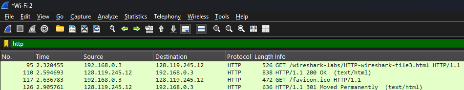
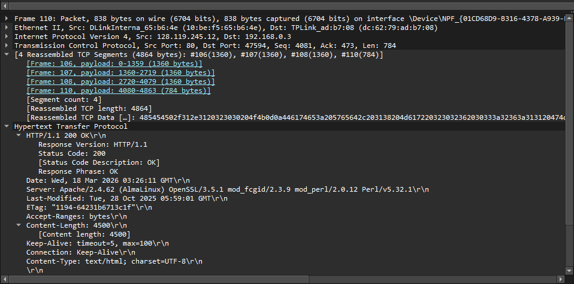
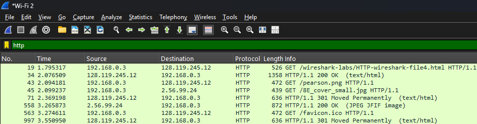
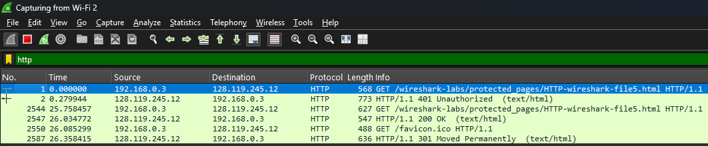

# MODUL 3 HTTP
Praktikum mata kuliah jaringan komputer mengenai protocol HTTP
## Tools 
- Wireshark
- Web Browser (Chrome 145)
- Text/Code Editor
# 1. Basic HTTP GET/response interaction
URL untuk Testing:  
[http://gaia.cs.umass.edu/wireshark-labs/HTTP-wireshark-file1.html]()

Step:
- Buka web browser
- Ketik url pada search bar [http://gaia.cs.umass.edu/wireshark-labs/HTTP-wireshark-file1.html]() 
- Buka wireshark
- Search "http" tanpa tanda kutip pada `filtering`

Gambar:
 
(Filtering) 

 (Full View)

 (Ketemu)

 (Data)

 

Penjelasan:
- Dapat dilihat bahwa client melakukan proses GET pada 
 
GET /wireshark-labs/HTTP-wireshark-file1.html HTTP/1.1
- lalu server memberikan response 200 OK

Jadi proses berhasil dengan baik karena Status code 200 menunjukkan server berhasil memproses request dan mengirim file HTML yang diminta.

# 2. HTTP CONDITIONAL GET
URL untuk Testing:  
[http://gaia.cs.umass.edu/wireshark-labs/HTTP-wireshark-file2.html]()

Step:
- Buka web broweser
- Hapus cache pada halaman [http://gaia.cs.umass.edu/]()
- Buka halaman [http://gaia.cs.umass.edu/wireshark-labs/HTTP-wireshark-file2.html]()
- refresh halaman atau buka halaman lagi pada web browser setelah halaman sudah benar benar terload
- ke wireshark `filter` "http" tanpa tanda kutip

Gambar:
 

Penjelasan:
- Halaman berhasil dibuka di indikasikan dengan HTTP Code 200 OK
- lalu setelah line 200 OK (saya melakukan refresh pada halaman)
- Server melihat cache dan melihat tidak ada yang berubah
- Maka server mengembalikan 304 Not Modified

Jadi proses menggunakan cache untuk menghemat dan mengefisiensikan data telah berhasil karena ketika 304 Not Modified maka client tidak perlu mengunduh ulang file dan dapat langsung mengambil pada cache browser.

# 3. Retrieving Long Documents
URL untuk Testing:  
[http://gaia.cs.umass.edu/wireshark-labs/HTTP-wireshark-file3.html]()

Step:
- Buka web browser
- Hapus cache untuk [http://gaia.cs.umass.edu/]()
- Buka halaman [http://gaia.cs.umass.edu/wireshark-labs/HTTP-wireshark-file3.html]()
- buka wireshark lalu `filter` "http" tanpa tanda kutip

Gambar:
 
(full view)

 (Data)

Penjelasan:
- Halaman berhasil di load dan terambil di indikasikan oleh HTTP Code 200 OK
- lalu bisa dilihat content length nya 4500 Bytes yang menandakan file yang diambil itu lumayan panjang
- Dibawah TCP information ada [4 Reassembled TCP Segments] yang dimana artinya dari 4500 Bytes yang harus diambil itu dibagi menjadi 4 segments dan di gabung kembali 1360 + 1360 + 1360 + 784 = 4864 bytes kenapa demikian (kok bertambah.)
jadi bytes tambahan ini juga sudah termasuk header jadi bukan cuman content length aja.

Jadi dalam pengambilan file yang besar server akan membagi packet TCP menjadi beberapa segmentasi keuntungannya apabila saat transport ada error pada frame tertentu maka hanya frame itu sajalah yang akan dikirim ulang.

# 4. HTML Documents dengan Embedded Objects
URL untuk Testing:  
[http://gaia.cs.umass.edu/wireshark-labs/HTTP-wireshark-file4.html]()

Step:
- Buka web browser
- Hapus cache untuk [http://gaia.cs.umass.edu/]()
- Buka halaman [http://gaia.cs.umass.edu/wireshark-labs/HTTP-wireshark-file4.html]()
- buka wireshark lalu `filter` "http" tanpa tanda kutip

Gambar:
 

Penjelasan:
- Halaman berhasil load di indikasikan dengan HTTP Code 200 OK
- ada 2 file html tambahan yang diambil pearson.png dan 8E_cover_small.jpg

Jadi untuk mengambil 2 embedded objects (dalam hal ini gambar) maka akan ada request HTTP terpisah tambahan karena setiap object harus diambil secara terpisah

# 5. HTTP Authentication
URL untuk Testing:  
[http://gaia.cs.umass.edu/wiresharklabs/protected_pages/HTTP-wireshark-file5.html]()

Step:
- Buka web browser
- Hapus cache untuk [http://gaia.cs.umass.edu/]()
- Buka halaman [http://gaia.cs.umass.edu/wiresharklabs/protected_pages/HTTP-wireshark-file5.html]()
- masukkan  Username : `wireshark-students` Password : `network`
- buka wireshark lalu `filter` "http" tanpa tanda kutip

Gambar:

Penjelasan:
- Saat buka webpage pertama kali (belum login) server mengembalikan HTTP Code 401 Unauthorized -> tidak di izinkan
- setelah memasukkan username dan password yang benar Username : `wireshark-students` & Password : `network` 
- akan mengembalikan file html dan HTTP Code 200 OK (berhasil)

Tambahan:
 

 
tentunya memasukkan credential saat mengakses HTTP tidak baik karena hanya di encode base64 (Bukan enkripsi!) jadi tidak aman dan username dan password terekspos

# Kesimpulan Praktikum
- HTTP menggunakan metode pull dimana client request dan server memperikan respond
- HTTP akan mengirim beberapa request jika content terlalu besar
- HTTP akan mengecheck cache untuk mempercepat akses file / halaman web
- melaksanakan proses AUTH tanpa HTTPS sangat rentan karena hanya di encode base64