# MODUL 4 DNS
Praktikum mata kuliah jaringan komputer mengenai protocol DNS (Domain Name System)

## Tools (Aplikasi / Program)
- Wireshark
- Browser
- Nslookup
- Command Prompt / Powershell
- Text / Code Editor

# Ada 5 bagian dalam pengerjaan
## Bagian 1:
### Soal:
1. Jalankan nslookup untuk mendapatkan alamat IP dari server web di Asia. Berapa alamat IP
server tersebut?
2. Jalankan nslookup agar dapat mengetahui server DNS otoritatif untuk universitas di Eropa.
3. Jalankan nslookup untuk mencari tahu informasi mengenai server email dari Yahoo! Mail
melalui salah satu server yang didapatkan di pertanyaan nomor 2. Apa alamat IP-nya?

### Jawaban:
1. [103.231.202.210](https://indonesia.go.id) Indonesia officical web 
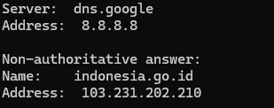
2. Server dns otoritatif Technical University of Munich
    -   dns1.lrz.de
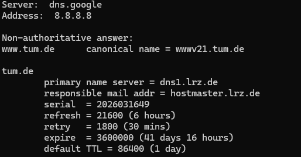
3. Tidak berhasil  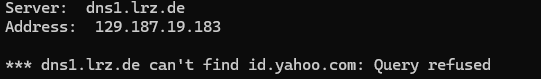  Sepertinya server dns pada kampus yang ingin saya coba  sebelumnya menolak untuk memberikan informasi terkait ip yahoo.com hal ini diindikasikan oleh <code>Query Refused</code>. Sebagai salah satu contoh yang berhasil saya memberikan dns kampus cambridge 
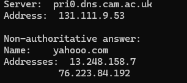 
Jawaban : **13.248.158.7 & 76.223.84.192**

## Bagian 2:
### Soal
1. Cari pesan permintaan DNS dan balasannya. Apakah pesan tersebut dikirimkan melalui UDP
atau TCP?
2. Apa port tujuan pada pesan permintaan DNS? Apa port sumber pada pesan balasannya?
3. Pada pesan permintaan DNS, apa alamat IP tujuannya? Apa alamat IP server DNS lokal anda
(gunakan ipconfig untuk mencari tahu)? Apakah kedua alamat IP tersebut sama?
4. Periksa pesan permintaan DNS. Apa “jenis” atau ”type” dari pesan tersebut? Apakah pesan
permintaan tersebut mengandung ”jawaban” atau ”answers”?
5. Periksa pesan balasan DNS. Berapa banyak ”jawaban” atau ”answers” yang terdapat di
dalamnya? Apa saja isi yang terkandung dalam setiap jawaban tersebut?
6. Perhatikan paket TCP SYN yang selanjutnya dikirimkan oleh host Anda. Apakah alamat IP
pada paket tersebut sesuai dengan alamat IP yang tertera pada pesan balasan DNS?
7. Halaman web yang sebelumnya anda akses (http://www.ietf.org) memuat beberapa
gambar. Apakah host Anda perlu mengirimkan pesan permintaan DNS baru setiap kali ingin
mengakses suatu gambar?
### Jawaban
1. UDP  
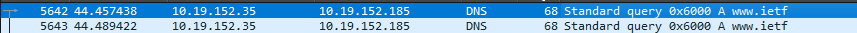
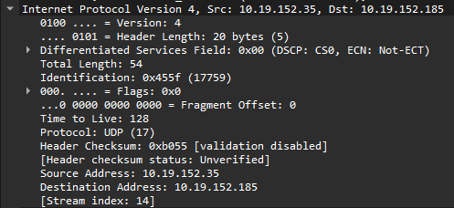
 
Terdapat informasi Protocol : UDP (17)

2. Port:
    - Destination Port : 53
    - Source Port : 65068 (port acak dari windows)
    - Response Port : 53 (balasan sama ke port 23)
 

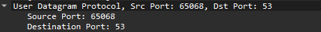
 

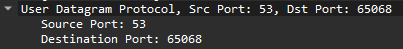

3. Ya, alamat IP tujuan pada paket DNS sama dengan alamat IP server DNS lokal pada pc saya.
 

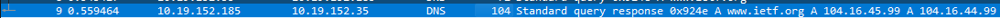
 

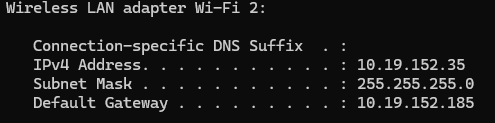

4. Type dari permintaan adalah A dan tidak memiliki "jawaban" 
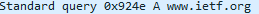

5. ada 2 yakni 104.16.45.99 dan 104.16.44.99
 

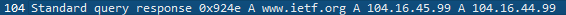

6. Sesuai. 
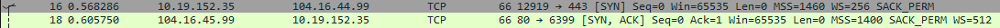

7. Tidak perlu

## Bagian 3:

### Soal
1. Apa port tujuan pada pesan permintaan DNS? Apa port sumber pada pesan balasan DNS?
2. Ke alamat IP manakah pesan permintaan DNS dikirimkan? Apakah alamat IP tersebut
merupakan default alamat IP server DNS lokal Anda?
3. Periksa pesan permintaan DNS. Apa ”jenis” atau ”type” dari pesan tersebut? Apakah pesan
tersebut mengandung ”jawaban” atau ”answers”?
4. Periksa pesan balasan DNS. Berapa banyak ”jawaban” atau “answers” yang terdapat di
dalamnya. Apa saja isi yang terkandung dalam setiap jawaban tersebut?
### Jawaban
1. Port pada request adalah 53 dan source dari response adalan 53 
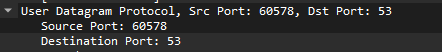
 
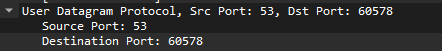

2. Tidak, ke 8.8.8.8 
3. Ya ada 4 Jawaban dengan tipe CNAME dan AAAA
4. ada 4 jawaban terdiri dari:
    - www.mit.edu.edgekey.net
    - e9566.dscb.akamaiedge.net
    - 2404:c0:3001:18a::255e
    - 2404:c0:3001:192::255e
 
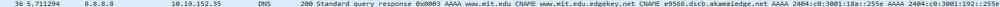

## Bagian 4:
### Soal
1. Ke alamat IP manakah pesan permintaan DNS dikirimkan? Apakah alamat IP tersebut
merupakan default alamat IP server DNS lokal Anda?
2. Periksa pesan permintaan DNS. Apa ”jenis” atau ”type” dari pesan tersebut? Apakah pesan
tersebut mengandung ”jawaban” atau ”answers”?
3. Periksa pesan balasan DNS. Apa nama server MIT yang diberikan oleh pesan balasan?
Apakah pesan balasan ini juga memberikan alamat IP untuk server MIT tersebut?
### Jawaban
1. Tidak, ke 8.8.8.8 
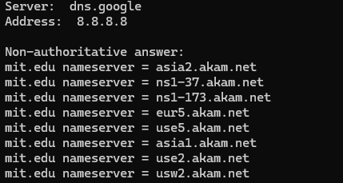
2. Tidak ada 
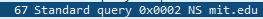
3. Tidak memberikan IP hanya 
    - eur5.akam.net
    - use2.akam.net
    - asia1.akam.net
    - ns1-37.akam.net
    - asia2.akam.net
    - use5.akam.net
    - ns1-173.akam.net
    - usw2.akam.net
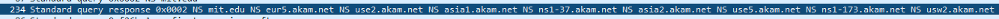

## Bagian 5
### Soal
1. Ke alamat IP manakah pesan permintaan DNS dikirimkan? Apakah alamat IP tersebut
merupakan default alamat IP server DNS lokal Anda?
2. Periksa pesan permintaan DNS. Apa ”jenis” atau ”type” dari pesan tersebut? Apakah pesan
tersebut mengandung ”jawaban” atau ”answers”?
3. Periksa pesan balasan DNS. Berapa banyak ”jawaban” atau “answers” yang terdapat di
dalamnya. Apa saja isi yang terkandung dalam setiap jawaban tersebut?
### Jawaban
1. ke 18.0.72.3 dan 18.0.72.3 bukan merupakan IP Server DNS Lokal  
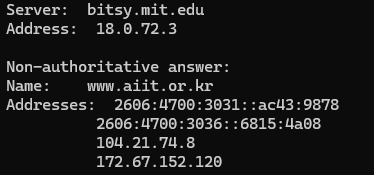
2. A dan AAAA (Tidak mengandung "jawaban")  
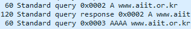
3. ada 4 jawaban terdiri dari A dan AAAA:
    - 104.21.74.8 dan 172.67.152.120
    - 2606:4700:3031::ac43:9878 dan 2606:4700:3036::6815:4a08
    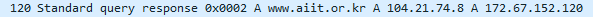
    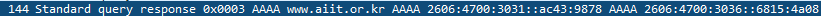

Kesimpulan Praktikum:
Praktikum kali ini belajar DNS menggunakan tools nslookup dengan parameternya serta mempelajari bagaimana sebuah request dan response terjadi dibelakang layar menggunakan wireshark.