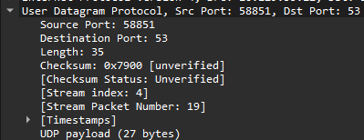
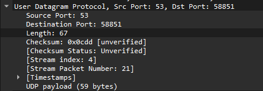

# MODUL 5 UDP

Praktikum mata kuliah jaringan komputer mengenai protocol UDP (User Datagram Protocol)

## Tools (Aplikasi / Program)

- Wireshark
- Browser
- Text / Code Editor

## Tugas

### Soal

1. Pilih satu paket UDP yang terdapat pada trace Anda. Dari paket tersebut, berapa banyak “field” yang terdapat pada header UDP? Sebutkan nama-nama field yang Anda temukan!
2. Perhatikan informasi “content field” pada paket yang Anda pilih di pertanyaan 1. Berapa
   panjang (dalam satuan byte) masing-masing “field” yang terdapat pada header UDP?
3. Nilai yang tertera pada ”Length” menyatakan nilai apa? Verfikasi jawaban Anda melalui
   paket UDP pada trace.
4. Berapa jumlah maksimum byte yang dapat disertakan dalam payload UDP? (Petunjuk:
   jawaban untuk pertanyaan ini dapat ditentukan dari jawaban Anda untuk pertanyaan 2)
5. Berapa nomor port terbesar yang dapat menjadi port sumber? (Petunjuk: lihat petunjuk
   pada pertanyaan 4)
6. Berapa nomor protokol untuk UDP? Berikan jawaban Anda dalam notasi heksadesimal dan
   desimal. Untuk menjawab pertanyaan ini, Anda harus melihat ke bagian ”Protocol” pada
   datagram IP yang mengandung segmen UDP.
7. Periksa pasangan paket UDP di mana host Anda mengirimkan paket UDP pertama dan paket
   UDP kedua merupakan balasan dari paket UDP yang pertama. (Petunjuk: agar paket kedua

### Jawaban

1. Header UDP terdiri dari empat field yakni: Source Port, Destination Port, Length, dan Checksum.
2. Setiap field pada header UDP itu besarannya 2 byte, sehingga total panjang header UDP adalah 8 byte.
3. Nilai Length menunjukkan gabungan total panjang dari segmen UDP (header + data). Contoh: Length = 58 byte maka dari itu terdiri atas 8 byte header + 50 byte payload. 
4. Panjang maksimum payload UDP adalah 65527 byte (65535 maksimum field Length – 8 byte header).
5. Nomor port terbesar yang dapat digunakan oleh UDP adalah 65535 (karena field port = 16 bit).
6. Nomor protokol untuk UDP adalah 17 (desimal) dan 0x11 (heksadesimal).
7. Hubungan port request–response:
   - Request: Source Port = 58851, Destination Port = 53
   - Response: Source Port = 53, Destination Port = 58851
   - Menunjukkan pembalikan peran pengirim–penerima.

## Lampiran

 
Memakai DNS karena menggunakan UDP
 

 
Request  
ada 4 Header yakni:
1. Source Port : 58851
2. Destination Port : 53
3. Length : 35
4. Checksum : 0x7900

 

 
Response
 
ada 4 Header yakni:
1. Source Port : 53
2. Destination Port : 58851
3. Length : 67
4. Checksum : 0x0cdd
 

**Dapat Dilihat pada Request bahwa UDP Payload nya 27. Sedangkan length pada header menunjukkan angka 35 hal ini dikarenakan besaran Header UDP adalah 8 Byte menjadikan total length sebesar 35Byte** 

