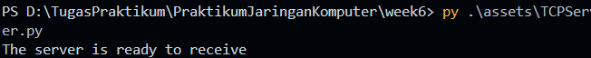
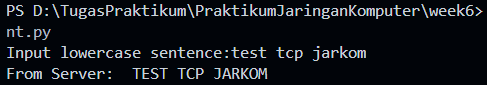
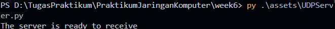
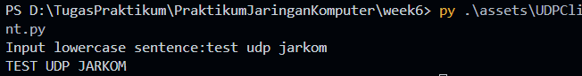

# MODUL 6 TCP

Praktikum mata kuliah jaringan komputer mengenai socket programming

## Tools (Aplikasi / Program)
- Text / Code Editor

## Tugas
### Link ke code:
- [`UDPClient.py`](./assets/UDPClient.py)
- [`UDPServer.py`](./assets/UDPServer.py)
- [`TCPClient.py`](./assets/TCPClient.py)
- [`TCPServer.py`](./assets/TCPServer.py)
`
### Cara menggunakan
1. **Jalankan Server**
   - UDP:  
     ```bash
     python UDPServer.py
     ```
   - TCP:  
     ```bash
     python TCPServer.py
     ```

2. **Jalankan Client**
   - UDP:  
     ```bash
     python UDPClient.py
     ```
   - TCP:  
     ```bash
     python TCPClient.py
     ```
### Hasil
### TCP Server

### TCP Client

### UDP Server

### UDP Client
