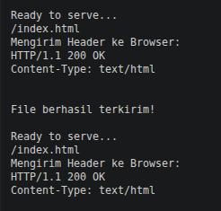

## Web Server

Praktikum mata kuliah jaringan komputer mengenai web server

## Tools (Aplikasi / Program)
- Text / Code Editor
- Browser
---

## 1. Library Import

```python
from socket import *
import sys
```

* **`socket`**: Pustaka utama untuk mengontrol komunikasi jaringan via protokol IP.
* **`sys`**: Digunakan untuk menghentikan eksekusi skrip secara bersih saat server dinonaktifkan.

---

## 2. Inisialisasi Socket Server

```python
serverSocket = socket(AF_INET, SOCK_STREAM)
```

* **`AF_INET`**: Menentukan penggunaan keluarga alamat IPv4.
* **`SOCK_STREAM`**: Menentukan bahwa koneksi menggunakan protokol berbasis aliran data (TCP).

---

## 3. Konfigurasi Alamat dan Port

```python
serverPort = 6790
serverSocket.bind(('', serverPort))
serverSocket.listen(1)
```

* **`bind(('', port))`**: Mengikat server ke port `6790`. Mengosongkan parameter IP (`''`) berarti server siap menerima koneksi dari kartu jaringan (interface) mana pun yang aktif.
* **`listen(1)`**: Mengaktifkan mode pendengaran koneksi dengan membatasi maksimal 1 antrean koneksi masuk sebelum ditolak.

---

## 4. Siklus Hidup (Main Loop) Server

```python
while True:
```

* Loop tak terbatas (`infinite loop`) agar server terus berjalan secara *real-time* untuk menangani setiap *request* yang masuk tanpa berhenti otomatis.

---

## 5. Manajemen Koneksi Masuk

```python
connectionSocket, addr = serverSocket.accept()
```

* **`accept()`**: Memblokir eksekusi skrip sementara waktu hingga ada klien yang terhubung.
  * **`connectionSocket`**: Objek *socket* baru yang dibuat khusus untuk bertukar data dengan klien tersebut.
  * **`addr`**: Berisi tuple informasi alamat IP dan port asal milik klien.

---

## 6. Pembacaan Request HTTP

```python
message = connectionSocket.recv(1024).decode()
```

* Membaca kiriman data dari browser maksimal sebesar 1024 bita, kemudian mengubah format bita mentah menjadi teks (*string*) menggunakan fungsi `.decode()`.

---

## 7. Pemrosesan Jalur Berkas (File Path Parsing)

```python
filename = message.split()[1]
f = open(filename[1:], encoding="utf-8")
```

* **`split()[1]`**: Memotong baris pertama HTTP request untuk mengambil parameter *path* (misalnya, mengambil `/index.html` dari teks `GET /index.html HTTP/1.1`).
* **`filename[1:]`**: Memotong karakter garis miring `/` di awal string agar sesuai dengan struktur direktori lokal (menjadi `index.html`).
* **`open(...)`**: Membuka berkas target dengan enkripsi UTF-8.

---

## 8. Ekstraksi Data Berkas

```python
outputdata = f.read()
```

* Membaca seluruh isi konten dari berkas yang berhasil dibuka dan menyimpannya ke dalam variabel memori.

---

## 9. Pengiriman HTTP Header

```python
header = "HTTP/1.1 200 OK\r\nContent-Type: text/html\r\n\r\n"
connectionSocket.send(header.encode())
```

* Mengirimkan status respons sukses (`200 OK`) dan tipe konten berupa HTML ke browser. Karakter `\r\n\r\n` wajib disertakan sebagai pembatas standar antara *header* dan *body* dokumen HTTP.

---

## 10. Pengiriman Konten Berkas

```python
for i in range(0, len(outputdata)):
    connectionSocket.send(outputdata[i].encode())
```

* Mengirimkan data dokumen HTML ke klien dengan metode iterasi per karakter (diubah kembali ke format bita saat dikirim).

---

## 11. Terminasi Sesi Klien

```python
connectionSocket.close()
```

* Memutus koneksi pada *socket* klien secara aman setelah seluruh data selesai ditransmisikan.

---

## 12. Manajemen Interupsi (Error Handling)

```python
except IOError:
    connectionSocket.send("HTTP/1.1 404 Not Found\r\n\r\n".encode())
    connectionSocket.send("<html><body><h1>404 Not Found</h1></body></html>\r\n".encode())
```

* Jika berkas yang diminta tidak ditemukan di direktori server (`IOError`), blok ini menangkap *error* tersebut dan mengirimkan respons status `404 Not Found` beserta halaman peringatan HTML sederhana ke browser.

---

## 13. Close Server

```python
serverSocket.close()
sys.exit()
```

* Menutup soket utama server untuk membebaskan port jaringan, lalu menghentikan proses program Python sepenuhnya.

# Terminal View
